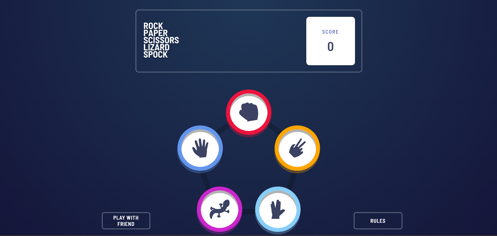

# 1. Rock, Paper, Scissors, Lizard, Spock Game

100 Projects Till I Get Hired: Project 1 - Rock, Paper, Scissors, Lizard, Spock

This is the first project in my personal series, 100 Projects Till I Get Hired, where I challenge myself to build 100 unique projects. The goal is to grow my skills, learn new technologies, and demonstrate my journey as a mid-level developer. This series is not just about coding—it’s about collaboration, sharing knowledge, and inspiring others.

In this project, I tackled the Rock, Paper, Scissors challenge from Frontend Mentor, enhancing the classic game with real-time multiplayer functionality using React, Node.js, and Socket.io.

Through this series, I aim to improve, inspire collaboration via pull requests, and pass on what I learn to friends who are just starting their journey into the amazing world of software development. I’m not an expert, but by working on these projects, I hope to continue growing my expertise and ultimately land my dream job in tech.

Stay tuned as I document my progress, learn, and share insights from each project along the way.

## Table of contents

- [Overview](#overview)
  - [The challenge](#the-challenge)
  - [Screenshot](#screenshot)
  - [Links](#links)
- [My process](#my-process)
  - [Built with](#built-with)
  - [Architecture Overview](#architecture-overview)
  - [Useful resources](#useful-resources)
- [Author](#author)
- [Acknowledgments](#acknowledgments)

**Note: Delete this note and update the table of contents based on what sections you keep.**

## Overview

### The challenge

1. Real-Time Synchronization
Challenge: Implementing real-time game state synchronization between multiple players across different devices required handling connection issues, disconnections, and updates to the game state without causing inconsistencies.
Solution: Leveraging Socket.io allowed real-time bidirectional communication between the server and clients. Careful handling of connection events, like player disconnects and reconnections, ensured that the game state was synchronized, even when a player left and rejoined.
2. Handling Dynamic Room Creation
Challenge: Dynamically generating rooms for players to join, while ensuring that players who shared a link could easily connect to the correct room.
Solution: Rooms were generated on the server using unique IDs (UUIDs), and players could join rooms through custom links. To handle routing on GitHub Pages, HashRouter was used to manage client-side navigation, allowing players to join specific rooms by clicking on the link.
3. GitHub Pages and Client-Side Routing
Challenge: GitHub Pages only serves static files, making it difficult to handle dynamic routes, which led to 404 errors when users accessed dynamically generated room URLs.
Solution: HashRouter was implemented to ensure proper client-side routing without relying on server-side functionality. Additionally, careful construction of the room URL ensured that players could join rooms via unique invitation links without encountering errors.
4. Managing Socket Disconnections
Challenge: When a player disconnected, ensuring the room and game state were updated properly for the remaining players.
Solution: Using socket.leave() ensured that players were removed from rooms properly when they disconnected or left, preventing any lingering notifications or game state issues for the remaining participants.

### Screenshot

### Links

- Backend URL: (https://github.com/CoderKnight02/rock-paper-scissors-server)
- Live Site URL: (https://coderknight02.github.io/rock-paper-scissors/)

## My process

### Built with

1. CSS:
Required Knowledge: Basic knowledge of CSS is sufficient, but certain aspects are important for responsive design and presentation:
Importing Google Fonts for custom typography.
Using media queries for responsive layouts.
Basics of animation for smooth interactions.
Understanding responsive units such as vw (viewport width) and vh (viewport height).
Basic element positioning, with a focus on flexbox for handling layout alignment and distribution.
2. HTML:
Required Knowledge: HTML is straightforward, but there are a few important concepts:
Familiarity with basic tags and event emitters, especially for buttons (onclick).
Most importantly, understanding how to maintain the game’s state (score tracking) using sessionStorage to persist data across page reloads.
3. JavaScript:
Required Knowledge: While the basics are essential, this project involves some specific JS patterns:
Using a matrix to handle the game logic, which required knowledge of module.exports for exporting functions and data across files.
Callback functions like forEach and map for array manipulation.
Understanding dictionaries (objects) as the primary data structure for handling rooms and players, especially with in-memory storage for the socket rooms.
4. React:
Required Knowledge: React required a deeper understanding of component lifecycle and state management:
Knowledge of Context.Provider for managing global state across components.
Dynamic routing (e.g., HashRouter for client-side routing on GitHub Pages).
Use of the useEffect hook for handling side effects and network requests.
A basic understanding of React’s component lifecycle and how it ties into event handling and rendering updates.
5. Node.js:
Required Knowledge: The backend setup involved fundamental Node.js concepts:
Setting up a basic web server using Express and enabling Cross-Origin Resource Sharing (CORS).
Using environment variables with .env for managing configuration.
Running the development server with nodemon for auto-reloading on changes.
Most importantly, integrating Socket.io for real-time communication between players in different rooms, which forms the core of the project’s architecture.

### Architecture Overview

Backend:
The backend is responsible for hosting the real-time connection using Socket.io. This enables players to join rooms, send game actions, and receive live updates from other players. It’s built using Node.js and Express, which provides a lightweight web server for handling connections, with CORS enabled to allow cross-origin requests between the frontend and backend.
The core of the backend revolves around in-memory storage for rooms and players, where each game room is tracked, and player interactions are managed. The backend listens for events like players joining or leaving rooms and broadcasts updates to other players in the same room.

Frontend:
The frontend is a React application that provides an interactive and responsive UI for players. It manages the game state, handles user actions, and updates the display in real time as messages are sent and received from the backend via Socket.io.
React plays a crucial role in managing the application's state, routing, and lifecycle through components. The Context API is used to maintain global state across different parts of the application, while dynamic routing (via HashRouter) ensures players can join specific game rooms based on their unique room IDs.
The use of React hooks like useEffect ensures that components react to changes in state or props and perform side effects, such as connecting to rooms or updating game data when needed.

**Note: Delete this note and the content within this section and replace with your own plans for continued development.**

### Useful resources

- [Example resource 1](https://www.example.com) - This helped me for XYZ reason. I really liked this pattern and will use it going forward.
- [Example resource 2](https://www.example.com) - This is an amazing article which helped me finally understand XYZ. I'd recommend it to anyone still learning this concept.

**Note: Delete this note and replace the list above with resources that helped you during the challenge. These could come in handy for anyone viewing your solution or for yourself when you look back on this project in the future.**

## Author

- Website - [Add your name here](https://www.your-site.com)
- Linkedin - [@manuel](www.linkedin.com/in/manuel-bacallao-pérez)

